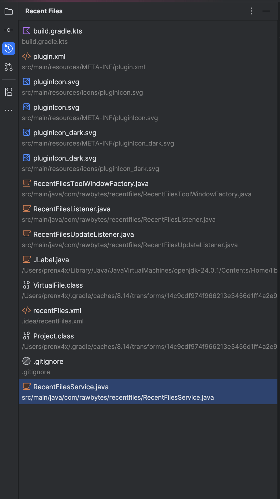

# Recent Files  Plugin for all Jetbrains IDEs

Displays a list of recently opened files in a tool window panel. The list is similar to the "Recent Files" popup (Ctrl+E), but it is persistent and can be docked in the IDE.

# Screenshots

# Also check out:

- [Hissab - Natural language calculator](https://hissab.io) - a vibe calculator with precise answers.
- [Random Name Picker](https://standup.name) - a tool to randomly select names from a list.
- [Rawbytes](https://rawbytes.io) - My personal blog about software development, AI, and more.